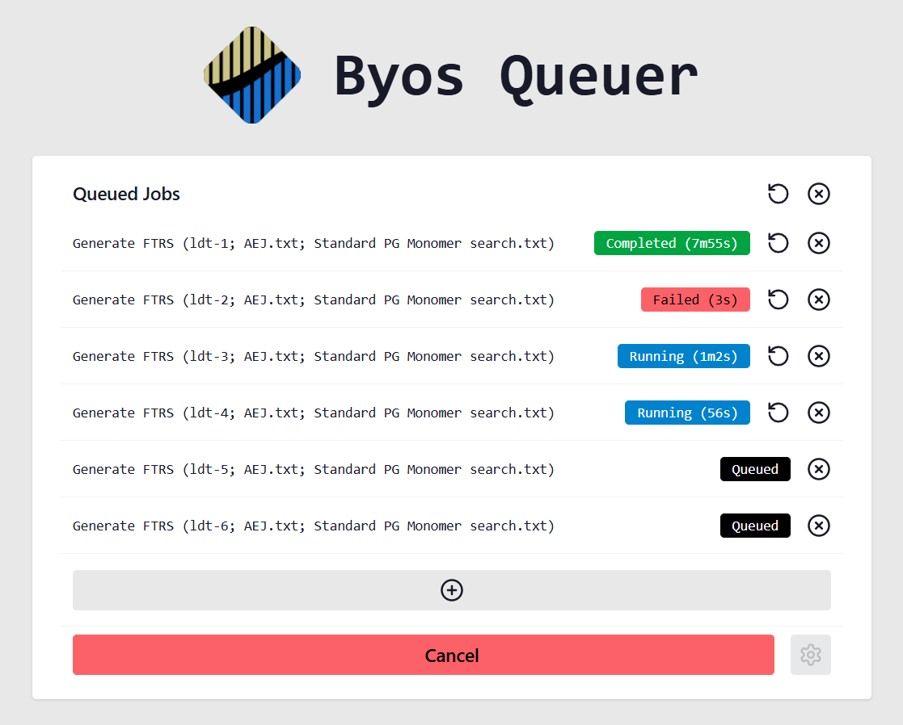

# Byos Queuer
A simple GUI for queuing Byos workflows and running them in parallel.



## Installation

These installation instructions assume that you've already installed the [PMI Suite](https://www.proteinmetrics.com/download/byos) on your computer.

### Adding `PMi-Byos-Console.exe` to your system's `Path` variable
1. Locate the folder containing `PMi-Byos-Console.exe` — by default, this should be `C:\Program Files\ProteinMetrics\PMI-Suite\Base`
2. Search for and open "Edit the system environment variables" using the Start Menu
3. In the newly opened window, click "Environment Variables..."
4. Search for `Path` under "System variables", double-clicking it to edit
5. Click "New" and paste in the path to the folder containing `PMi-Byos-Console.exe` (from Step 1)
6. Click "OK" to save and exit all dialogues

### Installing Byos Queuer
1. Navigate to [Releases](https://github.com/TheLostLambda/byos-queuer/releases/) and download the `.msi` from Byos Queuer's latest release
2. Double-click on the `.msi` file to install Byos Queuer

## Usage

To create a RAM disk for accelerating data deconvolution, you'll also need a program like [AIM Toolkit](https://sourceforge.net/projects/aim-toolkit/).

### _(Recommended)_ Create a RAM Disk Using AIM Toolkit
1. Launch "RamDisk Configuration" (part of AIM Toolkit)
2. In the "Basic" tab, configure the RAM disk's size _(Note 1)_
3. Next, select a free drive letter where you'd like the RAM disk to be mounted
4. Select the NTFS file system _(Note 2)_
5. _(Optional)_ Enable "Launch at Windows Startup" to automatically recreate this RAM disk after rebooting
6. Untick "Create TEMP Folder" to keep the RAM disk empty
7. Click "OK" to create the new RAM Disk

### Queuing and Running Jobs in Byos Queuer
1. Launch "Byos Queuer"
2. Click "Queue a job"
3. Select a base workflow pre-configured in Byos _(Notes 3 and 4)_
4. Select one or more samples to process _(Note 5)_
5. Select a file containing protein sequences to search for _(Note 6)_ 
6. _(Optional)_ Select a file describing modifications in Byos's custom modification syntax
7. _(Recommended)_ If a RAM disk is mounted, select it as Byos Queuer's working directory _(Note 7)_
8. Select an output directory for your search results to be written to
9. _(Optional)_ To queue a single job with multiple sample files, enable "Group Samples" _(Note 8)_
10. Click "Queue"
11. _(Optional)_ Click the gear icon to configure how jobs are launched _(Note 9)_
12. Click "Run" to start the queue
13. Wait for queued jobs to finish, resetting or reconfiguring failed jobs as needed _(Note 10)_

### Notes
1. If using a RAM disk with Byos Queuer, it needs to be large enough to hold the results of all of the Byos searches performed concurrently — for deconvolution, these tend to be 100–130 MB each. If you're planning to run 15 Byos jobs in parallel, then a safe size would be \~2 GB. Avoid the "Allocate Memory Dynamically" option as this results in decreased performance.
2. Though the tooltip in "RamDisk Configuration" claims that FAT file systems are usually faster, this does not appear to be the case for Byos: deconvolution was significantly faster on NTFS than FAT, FAT32, and exFAT.
3. All of Byos Queuer's input fields and options have a helpful tooltip; these can be viewed by hovering over each inputs' label text. Read these if you're ever unsure about what an option does or what type of file an input expects.
4. Byos Queuer's base workflow can be any `.wflw` file saved by Byos. If you're looking to deconvolute data and output `.ftrs` files for PGFinder, see Section 3.1.3 of [Rady and Mesnage, 2014](https://mesnage-org.github.io/pgfinder/Rady%20and%20Mesnage%202024.pdf). The workflow's samples, sequences, and modifications can be left blank, as these fields will be automatically filled by Byos Queuer.
5. If several sample files are uploaded simultaneously to Byos Queuer's "Queue Job(s)" dialogue, then they will all be queued with the same settings (base workflow, protein file, modifications, etc). Jobs that need to be run with different settings must be queued separately.
6. In Byos, the proteins file must be a FASTA file, but Byos Queuer also supports `.txt` files with one sequence per line; no sequence names are necessary.
7. Though selecting a RAM disk to be Byos Queuer's working directory will always result in the best performance, selecting one on a fast, solid-state drive can still boost performance if the output directory is somewhere on a slower drive (especially a hard-disk drive).
8. Only select "Group Samples" if you need a single `.blgc` result containing data from multiple `.raw` files; otherwise, this option only hurts performance.
9. By default, Byos Queuer runs up to 12 jobs in parallel and waits 3 seconds between launching each one. The number of parallel jobs can be adjusted if you have more or less free CPU/RAM, and the delay between job launches can be increased if jobs are often failing with "Could not cleanup folder" errors in the log file. Usually, however, these options don't need changing.
10. Because Byos wasn't designed to be run in parallel, parallel jobs can occasionally fail when two Byos instances attempt to clean up the same folder at the same time; staggering job launches helps but doesn't completely prevent these failures. If a job appears to fail for no reason, then it can be retried by clicking the reset button. Error messages can be seen by mousing over the red "Failed" status badge.

## Development

To build Byos Queuer, you'll need [`cargo`](https://rustup.rs/), [`deno`](https://deno.com/), [`dx`](https://dioxuslabs.com/learn/0.6/getting_started/#install-the-dioxus-cli), and [`just`](https://just.systems/man/en/installation.html) installed.

You can then run the following commands to open Byos Queuer and hot-reload automatically after each change:
```bash
# First:
just tailwatch
# Then, in a second terminal:
just serve
```
